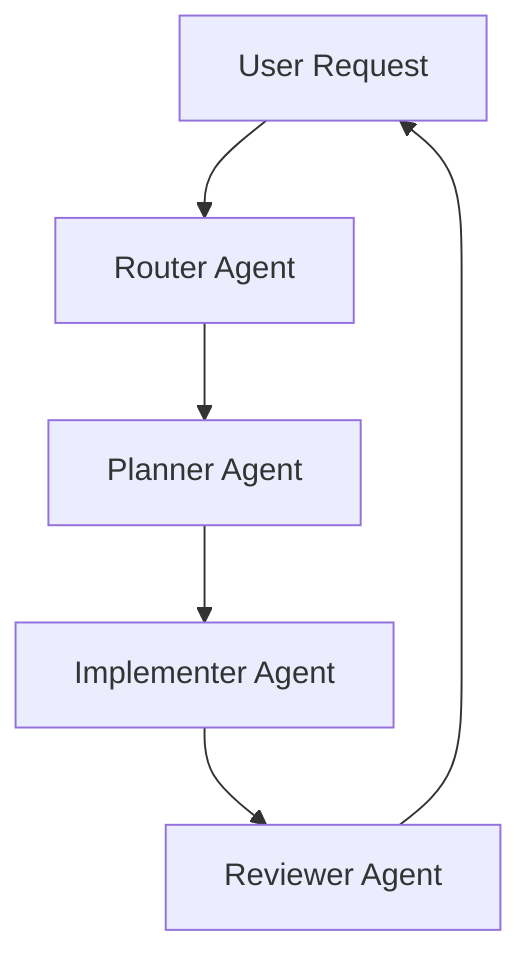

# 🤖 AI Project Template

🌍 **Languages / Idiomes / Idiomas**

- 🇬🇧 [English](README.en.md)
-    [Català](README.ca.md)
- 🇪🇸 [Español](README.es.md)

---

## 🚀 AI-First Software Development Template

A professional **AI-First development template** designed to build software using orchestrated AI agents and **Spec-Driven Development (SDD)**.

Instead of relying on long chat conversations with AI, this template introduces a **structured system of agents, documents and workflows** that allows AI to participate in software development in a controlled and scalable way.

The developer remains the **architect and decision maker**, while AI agents execute tasks such as planning, coding and reviewing.

---

# 🧠 Core Idea

Development becomes a process of **defining intent and orchestrating execution**.

```
Specification → Planning → Implementation → Review
```

Each phase is executed by a specialized AI agent.

---

# ⚙️ Multi-Agent Architecture



Each agent operates with **clear responsibilities and fresh context**, reducing confusion and improving reliability.

---

# 📂 Project Structure

```
ai-project-template
│
├── agents
│
├── prompts
│
├── contracts
│
├── docs
│
├── skills
│
├── AGENTS.md
│
├── ORCHESTRATOR.md
│
└── README.md
```

---

# 🧩 Development Workflow

This project follows a **Spec-Driven Development pipeline**.

### 1️⃣ Define the Specification

Edit:

```
docs/01_SPEC.md
```

Describe the product behaviour and requirements.

---

### 2️⃣ Plan the Work

The **Planner Agent** converts the specification into structured tasks.

Output:

```
docs/03_TASKS.md
```

Example:

```
TASK-001 Create user model
TASK-002 Implement authentication endpoint
TASK-003 Add password hashing
```

---

### 3️⃣ Implement the Feature

The **Implementer Agent** reads:

```
docs/03_TASKS.md
docs/02_ARCHITECTURE.md
docs/06_CURRENT_SPRINT.md
```

and generates the code.

---

### 4️⃣ Review the Implementation

The **Reviewer Agent** validates:

- architecture
- code quality
- security
- tests

---

# 🛠 Compatible AI Tools

This template works with many AI-assisted development environments:

- OpenAI Codex
- Claude Code
- Cursor
- OpenCode
- VS Code AI assistants

---

# 🎯 Who Is This For

This repository is designed for:

- Developers learning **AI-assisted development**
- Teams experimenting with **multi-agent workflows**
- Engineers exploring **Spec-Driven Development**
- Builders creating **AI-First software systems**

---

# 📜 License

MIT License